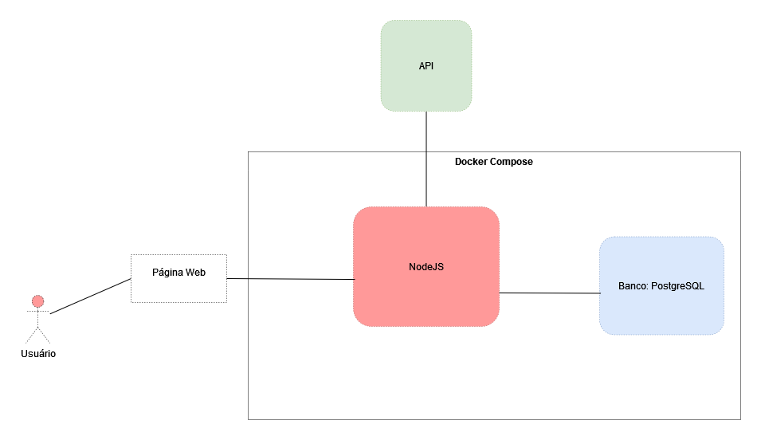

# API de Clima 
Microsserviços de nodejs e postgres em Docker para visualizar informações sobre o clima

## Arquitetura:

## Instalação:
`git clone https://github.com/vinimendes/apiclima-nodejs-docker.git`

### Após o clone do repositório será necessário entrar na pasta "apiclima-nodejs-docker" gerada:

`cd apiclima-nodejs-docker/`

### Build do docker-compose.yml presente na pasta:
`docker-compose up -d --build --force-recreate`

## Como usar a API:
Acesse o navegador de sua preferência, e digite acesse a url `localhost:4976`
será mostrado como default a temperatura de Maceió. Para realizar o registro das informações no banco basta
acessar o link `localhost:4976/maceio`. No momento há a possibilidade de registrar a temperatura de Florianópolis
também a partir do link: `localhost:4976/florianopolis`
